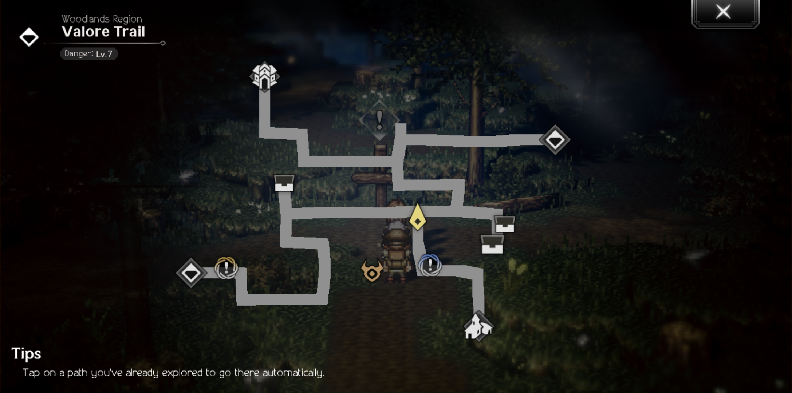

## MiniMapUtil - CotC datamining

Tool that generates the in-game local minimaps from the serialized `PathActors` 
files found in `\Game\Level\PathActor\V1_0_0\`. 
The files can be serialized using [UEParse](https://github.com/JillCrungus/UEParse).

### Usage

An installation of Python (script developed using 3.8.7) with the following packages is required to run the program:
- `Pillow 9.2.0`

### Example

<u>Original map</u>

<u>Generated map</u>
